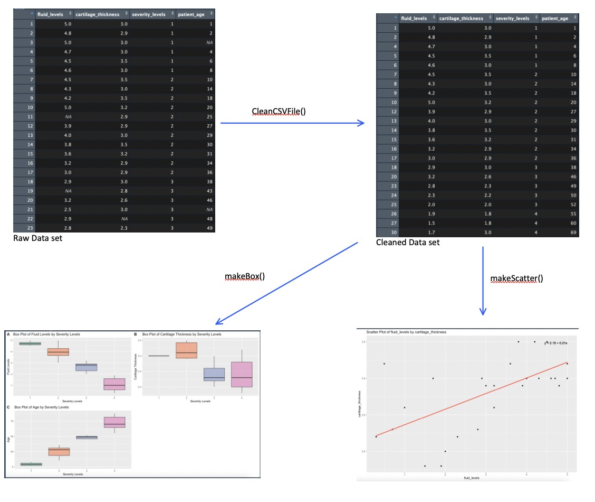

<!-- README.md is generated from README.Rmd. Please edit that file -->

# OsteoAnalizer

<!-- badges: start -->
<!-- badges: end -->

The goal of OsteoAnalizer is to clean CSV data sets containing
information related to Osteoarthritis. The package also aims to analyse
the relation between the 4 key aspects of Osteoarthritis(i.e fluid
levels, cartilage thickness, severity levels, and patient age) by output
visual elements.

R Version: R version 4.3.1 (2023-06-16) Platform: x86_64-apple-darwin20

## Installation

You can install the development version of OsteoAnalizer like so:

``` r
require("devtools")
devtools::install_github("ika-joshi/OsteoAnalizer", build_vignettes = TRUE)
library("OsteoAnalizer")
```

## Installation

You can install the development version of OsteoAnalizer like so:

``` r
require("devtools")
devtools::install_github("ika-joshi/OsteoAnalizer", build_vignettes = TRUE)
library("OsteoAnalizer")
```

## Overview

A quick overview of the package

``` r
ls("package:OsteoAnalizer")
data(package = "OsteoAnalizer") # optional
browseVignettes("OsteoAnalizer")
```

OsteoAnalizer contains 3 functions:

cleanCSVFile cleans and organizes a CSV file into 4 columns(i.e fluid
levels, cartilage thickness, severity levels, and patient age) which is
stored in a list.

makeBox visualizes fluid levels, cartilage thickness and patient age
against severity levels. It creates a box plot of each of the variable
mentioned with severity level.

makeScatter visualizes the relation between any two variables from fluid
levels, cartilage thickness and patient age. It creates a scatter plot
of the two chosen variable. It also takes performs linear regression
analysis on the two chosen variables.

<div style="text-align:center">



## Contributions

The package was developed by Krutika Joshi.

- Package `na.omit` is used to clean datasets in `CleanCSVFile`.

- Package `read.csv` is used to read the CSV file in `CleanCSVFile`.

- Package `ggplot2` is used to create box plots and scatter plots
  respectively in function `makeBox` and `makeScatter`.

- Package `cowplot` is used to combine boxplots plots in function
  `makeBox`.

- Package `ggpmisc` is used to show the line of regression in
  `makeScatter`.

- Package `coef` is used to compute the line of regression in
  `makeScatter`.

- Package `lm` is used to compute the line of regression in
  `makeScatter`.

## References

Bates, C. (2023, April 9). Tutorial: Loading and cleaning data with R
and the Tidyverse. Dataquest.
<https://www.dataquest.io/blog/load-clean-data-r-tidyverse/>

Chatgpt. ChatGPT. (n.d.). <https://openai.com/chatgpt>

Claus O. Wilke (2017). cowplot: Streamlined Plot Theme and Plot
Annotations for ‘ggplot2’. <https://github.com/wilkelab/cowplot>.

GeeksforGeeks. (2022, December 26). How to color scatter plot points in
R ?. GeeksforGeeks.
<https://www.geeksforgeeks.org/how-to-color-scatter-plot-points-in-r/>

Holtz, Y. (n.d.). Control Ggplot2 Boxplot colors. – the R Graph Gallery.
<https://r-graph-gallery.com/264-control-ggplot2-boxplot-colors.html>

Li, F. (2022) sexDisaggregate:To Obtain and Analyze Sex-disaggregated
Datasets, Unpublished. URL
<https://github.com/lifangy6/sexDisaggregate>”

R box plot. DataMentor. (n.d.).
<https://www.datamentor.io/r-programming/box-plot>

R Core Team (2023). *R: A Language and Environment for Statistical
Computing*. R Foundation for Statistical Computing, Vienna, Austria.
<https://www.R-project.org/>.

Scatter plot in R programming 🟢 \[with examples\]. R CODER. (2021, June
18). <https://r-coder.com/scatter-plot-r/>

Wickham H (2016). ggplot2: Elegant Graphics for Data Analysis.
Springer-Verlag New York. ISBN 978-3-319-24277-4,
<https://ggplot2.tidyverse.org>.

## Acknowledgements

This package was developed as part of an assessment for 2022 BCB410H:
Applied Bioinformatics course at the University of Toronto, Toronto,
CANADA. OsteoAnalizer welcomes issues, enhancement requests, and other
contributions. To submit an issue, use the GitHub issues.

## Tree Structure

``` r
- OsteoAnalizer
  |- .gitignore
  |- .Rbuildignore
  |- .RData
  |- .Rhistory
  |- data
    |- my_data.rda
  |- DESCRIPTION
  |- inst
    |- extdata
      |- example_data.csv
      |- overview.jpg
  |- LICENSE
  |- LICENSE.md
  |- man
    |- CleanCSVFile.RD
    |- figures
      |- README-pressure-1.png
    |- makeBox.Rd
    |- makeScatter.Rd
    |- my_data.Rd
  |- NAMESPACE
  |- OsteoAnalizer.Rproj
  |- R
    |- CleanCSVFile.R
    |- data.R
    |- makeBox.R
    |- makeScatter.R
  |- README.md
  |- README.RMD
  |- tests
    |- testthat
      |- test-CleanCSVFile.R
      |- test-makeBox.R
      |- test_makeScatter.R
    |- testthat.R
```
